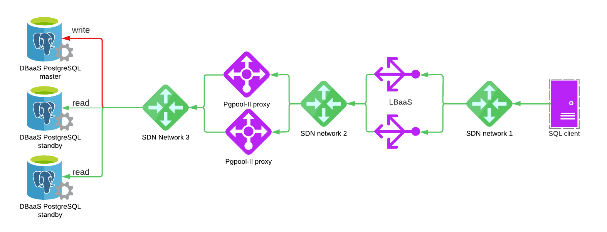

# Terraform LBaaS-ProxySQL-DBaaS demo

Please note that this is just an example on how you can use Terraform with [UpCloud](https://upcloud.com/) and should not be used in production as is. Please see [LICENSE](LICENSE) for details.



## Usage
Demo uses UpCloud LBaaS and [Pgpool-II](https://www.pgpool.net/) to create read/write splitting in front of [UpCloud DBaaS](https://upcloud.com/products/managed-databases/) services.

### Prerequisites

Project uses [Terraform](https://www.terraform.io/) and should be installed. We're also using UpCloud's Terraform provider but it should be automatically installed by running `terraform init`.

To create the resources with Terraform, you'll need your API credentials exported.

```
export UPCLOUD_USERNAME=your_username
export UPCLOUD_PASSWORD=your_password
```

You must also create config.tfvars file with your own settings:
 
```
zone = "pl-waw1"
dbaas_plan = "3x2xCPU-4GB-100GB"
pgpool_proxy_plan = "1xCPU-1GB"
ssh_key_public = "ssh-rsa AAAA_YOUR_SSH_PUBLIC_KEY"
```

### Quickstart

**IMPORTANT: Make sure your SSH-agent is running (execute this if not: `eval$(ssh-agent) && ssh-add <path_to_private_key> && ssh-add -L`), so Terraform scripts can SSH into VMs using agent forwarding**


### Creating services with basic configuration

Initate the project and install providers.

```
make init
```

Demo can now be created with Terraform. Creation takes around 10 minutes.

```
make create
```

### Testing stuff

After demo has been created you should log in to sql-client server with SSH and test the setup. You can print out the relevant IP addresses by running:

```
make print
```

Log in by running `ssh root@<sql_client_ip_address>`

You can ping the DBaaS with `bash ping-psql.sh <LBaaS hostname>`

You can prepare DBaaS for benchmarking with `bash prepare-benchmark <LBaaS hostname>` and you can run the benchmarks with `bash run-benchmark <LBaaS hostname>`.

You can use `bash show-servers.sh <LBaaS hostname>` to view DBaaS backends and how many select queries have been processed by which backend.


### Destroying stuff

After testing things around its good to free the resources. Tearing the thing down is also just one command.

```
make destroy
```

